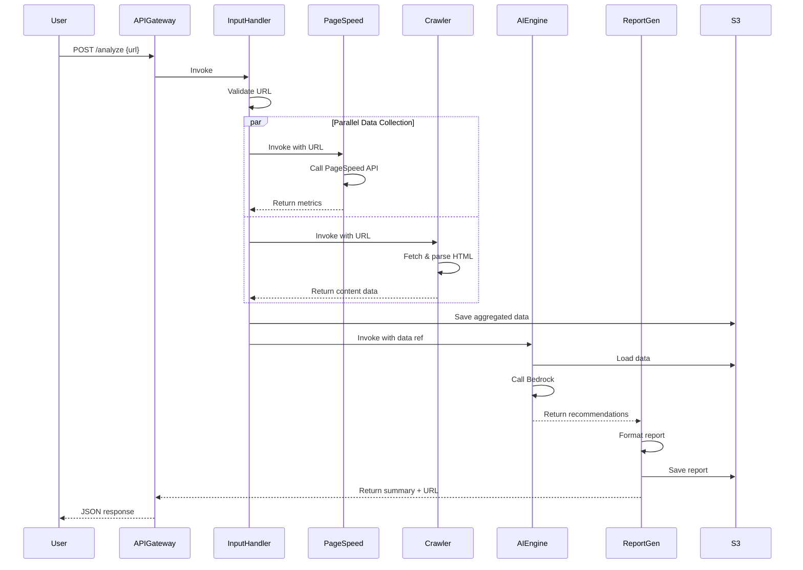

# AWS AI SEO Agent - Technical Architecture

## System Architecture Overview

```
┌─────────────────────────────────────────────────────────────────┐
│                        API Gateway (REST)                       │
│                     /api/v1/analyze (POST)                      │
└────────────────────────────────┬────────────────────────────────┘
                                 │
                                 ▼
┌─────────────────────────────────────────────────────────────────┐
│                   Input Handler Lambda                          │
│  - URL Validation                                               │
│  - Request Orchestration                                        │
│  - Error Handling                                               │
└─────────────┬───────────────────────────┬───────────────────────┘
              │                           │
              ▼                           ▼
┌─────────────────────────┐   ┌──────────────────────────────────┐
│ PageSpeed Collector     │   │   Content Crawler Lambda         │
│ Lambda                  │   │   - HTTP Request                 │
│ - Call PageSpeed API    │   │   - HTML Parsing                 │
│ - Extract Metrics       │   │   - SEO Element Extraction       │
│ - Parse Core Web Vitals │   │   - Content Analysis             │
└─────────────┬───────────┘   └──────────────┬───────────────────┘
              │                              │
              │  ┌────────────────────────┐  │
              └─→│  Data Aggregator       │←─┘
                 │  (S3 Temp Storage)     │
                 └──────────┬─────────────┘
                            │
                            ▼
              ┌──────────────────────────────┐
              │   AI Analysis Engine         │
              │   (Lambda + AWS Bedrock)     │
              │   - Data Synthesis           │
              │   - Claude 3 Sonnet          │
              │   - Recommendation Gen       │
              └──────────┬───────────────────┘
                         │
                         ▼
              ┌──────────────────────────────┐
              │   Report Generator Lambda    │
              │   - JSON Formatting          │
              │   - Markdown Generation      │
              │   - Score Calculation        │
              │   - Prioritization           │
              └──────────┬───────────────────┘
                         │
                         ▼
              ┌──────────────────────────────┐
              │   S3 Bucket (Reports)        │
              │   - JSON Reports             │
              │   - Markdown Reports         │
              └──────────────────────────────┘
```

## Component Details

### 1. API Gateway
**Purpose**: REST API endpoint for external access

**Configuration**:
- REST API type
- Regional endpoint
- API key authentication
- Rate limiting: 100 requests/minute per key
- CORS enabled
- Request validation enabled

**Endpoints**:
- `POST /api/v1/analyze`
  - Request body validation
  - Response mapping templates
  - Integration with Input Handler Lambda

### 2. Input Handler Lambda

**Runtime**: Python 3.11
**Memory**: 256 MB
**Timeout**: 60 seconds

**Responsibilities**:
1. Validate URL format and accessibility
2. Check URL is reachable (HEAD request)
3. Invoke PageSpeed Collector and Content Crawler in parallel
4. Wait for both collectors to complete
5. Aggregate results
6. Invoke AI Analysis Engine
7. Return final report

**Environment Variables**:
- `PAGESPEED_LAMBDA_ARN`
- `CRAWLER_LAMBDA_ARN`
- `AI_LAMBDA_ARN`
- `S3_TEMP_BUCKET`

**IAM Permissions**:
- Lambda invoke
- S3 read/write (temp bucket)
- CloudWatch logs

### 3. PageSpeed Collector Lambda

**Runtime**: Python 3.11
**Memory**: 512 MB
**Timeout**: 45 seconds

**Dependencies**:
- `requests` - HTTP client
- `boto3` - AWS SDK

**Responsibilities**:
1. Call PageSpeed Insights API v5
2. Extract performance metrics
3. Parse Core Web Vitals
4. Extract opportunities and diagnostics
5. Return structured data

**Environment Variables**:
- `PAGESPEED_API_KEY` (from Secrets Manager)
- `PAGESPEED_API_URL`

**IAM Permissions**:
- Secrets Manager read
- CloudWatch logs

**API Call**:
```python
url = f"https://www.googleapis.com/pagespeedinsights/v5/runPagespeed"
params = {
    "url": target_url,
    "key": api_key,
    "category": ["performance", "seo", "accessibility"],
    "strategy": "mobile"  # or "desktop"
}
response = requests.get(url, params=params)
```

### 4. Content Crawler Lambda

**Runtime**: Python 3.11
**Memory**: 1024 MB
**Timeout**: 30 seconds

**Dependencies**:
- `requests` - HTTP client
- `beautifulsoup4` - HTML parsing
- `lxml` - XML/HTML parser
- `boto3` - AWS SDK

**Responsibilities**:
1. Fetch HTML content via HTTP GET
2. Parse HTML using BeautifulSoup
3. Extract SEO elements:
   - Title, meta tags
   - Headings (H1-H6)
   - Images and alt text
   - Links (internal/external)
   - Structured data (JSON-LD)
   - Open Graph tags
4. Calculate content metrics
5. Return structured data

**Environment Variables**:
- `USER_AGENT`
- `REQUEST_TIMEOUT`
- `MAX_CONTENT_SIZE`

**IAM Permissions**:
- CloudWatch logs

### 5. AI Analysis Engine Lambda

**Runtime**: Python 3.11
**Memory**: 2048 MB
**Timeout**: 120 seconds

**Dependencies**:
- `boto3` - AWS SDK
- `json` - JSON processing

**Responsibilities**:
1. Load PageSpeed and content data
2. Construct AI prompt with data
3. Call AWS Bedrock (Claude 3 Sonnet)
4. Parse AI response
5. Structure recommendations
6. Return analysis results

**Environment Variables**:
- `BEDROCK_MODEL_ID` (e.g., `anthropic.claude-3-sonnet-20240229-v1:0`)
- `BEDROCK_REGION`
- `MAX_TOKENS`
- `TEMPERATURE`

**IAM Permissions**:
- Bedrock invoke model
- S3 read (temp bucket)
- CloudWatch logs

**Bedrock Configuration**:
```python
modelId = "anthropic.claude-3-sonnet-20240229-v1:0"
inference_config = {
    "maxTokens": 4096,
    "temperature": 0.7,
    "topP": 0.9
}
```

### 6. Report Generator Lambda

**Runtime**: Python 3.11
**Memory**: 512 MB
**Timeout**: 30 seconds

**Dependencies**:
- `boto3` - AWS SDK
- `json` - JSON processing

**Responsibilities**:
1. Receive recommendations from AI engine
2. Calculate overall score
3. Prioritize recommendations (quick wins)
4. Format as JSON
5. Generate Markdown (optional)
6. Save to S3
7. Return report URL and summary

**Environment Variables**:
- `S3_REPORTS_BUCKET`
- `REPORT_RETENTION_DAYS`

**IAM Permissions**:
- S3 write (reports bucket)
- CloudWatch logs

## Data Flow Sequence



## AWS Services Used

### Compute
- **AWS Lambda**: Serverless functions for all components
  - Runtime: Python 3.11
  - VPC: Not required (public internet access needed)
  - Reserved concurrency: 10 per function

### AI/ML
- **AWS Bedrock**: Foundational model service
  - Model: Claude 3 Sonnet
  - On-demand pricing
  - Region: us-east-1 (or supported region)

### Storage
- **Amazon S3**: 
  - Temp data bucket (lifecycle: 1 day)
  - Reports bucket (lifecycle: 90 days)
  - Encryption: AES-256
  - Versioning: Enabled for reports

### API Management
- **Amazon API Gateway**:
  - REST API
  - API keys for authentication
  - Usage plans and throttling
  - CloudWatch logging enabled

### Security
- **AWS Secrets Manager**: Store API keys
  - PageSpeed Insights API key
  - Automatic rotation: Disabled (external API)

### Monitoring
- **Amazon CloudWatch**:
  - Lambda function logs
  - API Gateway logs
  - Custom metrics:
    - Analysis success/failure rate
    - Average processing time
    - Cost per analysis
  - Alarms:
    - Error rate > 5%
    - Lambda timeout rate > 2%
    - API 4xx/5xx rate > 10%

### Infrastructure as Code
- **AWS CloudFormation** or **Terraform**:
  - Define all resources
  - Separate stacks for dev/staging/prod
  - Version controlled

## Security Architecture

### Authentication & Authorization
1. **API Gateway**: API key authentication
2. **Lambda Execution Roles**: Principle of least privilege
3. **S3 Bucket Policies**: Restrict access to Lambda roles only

### Data Protection
1. **Encryption in Transit**: HTTPS/TLS 1.2+
2. **Encryption at Rest**: S3 AES-256
3. **Secrets Management**: AWS Secrets Manager
4. **Input Validation**: Strict URL validation, max size limits

### Network Security
1. **Lambda**: No VPC required (reduces attack surface)
2. **API Gateway**: Rate limiting and throttling
3. **WAF** (optional): Protect API Gateway from common attacks

### Compliance
- No PII storage
- No sensitive data logging
- CloudTrail enabled for audit

## Scalability & Performance

### Horizontal Scaling
- Lambda auto-scales based on load
- Concurrent execution limit: 1000 (default, can increase)
- Each function scales independently

### Performance Optimization
1. **Parallel Execution**: PageSpeed and Crawler run concurrently
2. **Lambda Warm-up**: Provisioned concurrency for production (optional)
3. **Caching**: Consider ElastiCache for repeated URLs (future)
4. **Batch Processing**: Future enhancement for multiple URLs

### Cost Optimization
1. **Lambda**: Pay per invocation and duration
2. **S3**: Lifecycle policies to delete old data
3. **Bedrock**: Token-based pricing, optimize prompts
4. **CloudWatch**: Log retention: 7 days

### Estimated Cost per Analysis
- Lambda invocations: $0.001
- Lambda compute: $0.005
- Bedrock API call: $0.030
- S3 storage: $0.0001
- API Gateway: $0.001
- **Total**: ~$0.037 per analysis

## Deployment Strategy

### Environments
1. **Development**: For active development
2. **Staging**: Pre-production testing
3. **Production**: Live environment

### CI/CD Pipeline
```
Code Commit → GitHub Actions
    ↓
Unit Tests
    ↓
Integration Tests
    ↓
Build Lambda Packages
    ↓
Deploy to Dev
    ↓
Automated Tests
    ↓
Deploy to Staging (Manual Approval)
    ↓
Deploy to Production (Manual Approval)
```

### Deployment Steps
1. Package Lambda functions
2. Upload to S3 artifacts bucket
3. Update CloudFormation/Terraform
4. Run database migrations (if any)
5. Update Lambda function code
6. Run smoke tests
7. Monitor CloudWatch metrics

## Monitoring & Alerting

### Key Metrics
1. **Availability**: API uptime percentage
2. **Latency**: P50, P95, P99 response times
3. **Error Rate**: 4xx and 5xx errors
4. **Cost**: Daily spend tracking
5. **Usage**: Requests per day/hour

### Dashboards
- **Operational Dashboard**: Real-time metrics
- **Business Dashboard**: Usage trends and costs
- **Error Dashboard**: Error rates and types

### Alerts
- API error rate > 5% (15 min)
- Lambda timeout > 2% (5 min)
- Daily cost > $50
- PageSpeed API failures > 10% (10 min)

## Disaster Recovery

### Backup Strategy
- S3 versioning enabled for reports
- Lambda function code in version control
- Infrastructure as Code in version control
- Secrets Manager automatic backup

### Recovery Objectives
- **RTO (Recovery Time Objective)**: 1 hour
- **RPO (Recovery Point Objective)**: 1 hour

### Recovery Procedures
1. Redeploy infrastructure from IaC
2. Restore Lambda functions from S3
3. Restore secrets from Secrets Manager backup
4. Verify API functionality

## Future Architecture Enhancements

### Phase 2
- Add SQS for asynchronous processing
- Implement DynamoDB for analysis history
- Add ElastiCache for caching repeated URLs
- Implement Step Functions for complex workflows

### Phase 3
- Multi-region deployment
- Real-time monitoring dashboard (web UI)
- Scheduled scans using EventBridge
- Batch analysis using S3 triggers

### Phase 4
- Streaming analysis updates (WebSocket)
- Machine learning model for custom recommendations
- Integration with other SEO tools
- White-label API for partners
